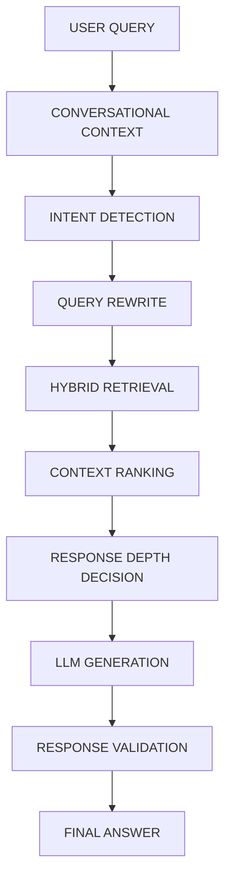

# Informe de Reingeniería: Motor Conversacional Flebitech

Este documento resume los cambios estructurales, lógicos y de código aplicados para transformar a Flebitech en un tutor clínico avanzado con conciencia del contexto.

## 1. Archivos Modificados y Creados

*   **`backend/prompt_system.py`**: (Reescritura completa) Se centralizó aquí la inteligencia del router, las directrices de profundidad (Nivel 1 al 5), las reglas de continuidad y los lineamientos de no-invención.
*   **`backend/orchestrator.py`**: (Modificación estructural) Se implementó la tubería completa de *Orquestación* para procesar los *intents* devueltos por el router, ajustar dinámicamente los parámetros del RAG, rechazar consultas fuera de dominio y coordinar la respuesta final.
*   **`backend/groq_client.py`**: (Ajuste de fallbacks) Se actualizó la lógica de fallback determinista para encajar con el nuevo esquema de *intents* (asumiendo `nivel_2` en caso de error del LLM).
*   **`test_flebitech.py`**: (Actualización) Se ajustaron las aserciones y tests de *Guardrails* y *FastAPI* para validar el correcto funcionamiento contra la nueva arquitectura. Todas las pruebas (225/225) se ejecutan con éxito.
*   **`test_conversacional.py`**: (Nuevo) Se creó para testear secuencias de chat y evaluar el comportamiento de memoria.

## 2. Nueva Arquitectura del Pipeline

El flujo de procesamiento para cada turno conversacional ahora sigue una estricta jerarquía de 10 pasos:

## 3. Detección de Intención (Intent Detection)

Se eliminó el esquema básico que solo clasificaba en "clínico" o "fuera de dominio". El Router ahora clasifica cada consulta en **13 intenciones posibles** (sin mostrarlo al usuario), para garantizar que la respuesta entregue exactamente lo que se necesita:

1.  `dato_puntual`: Consulta por datos específicos (Ej: "pH de la vancomicina").
2.  `explicacion`: Solicita entender un concepto brevemente.
3.  `guia_completa`: Requiere la base íntegra (Ej: "Escala INS completa").
4.  `profundizacion`: Pide explorar sobre el turno anterior (Ej: "Amplía el grado 2").
5.  `comparacion`: Contrastar conceptos.
6.  `criterios`: Evaluar elegibilidad.
7.  `conducta`: Conocer acciones clínicas.
8.  `algoritmo`: Solución paso a paso.
9.  `medicamento` / `cateter`: Dimensiones amplias.
10. `tematica_general`: Entradas de una sola palabra (Ej: "flebitis").
11. `is_continuation (True/False)`: Establece si es necesario utilizar memoria histórica.

## 4. Reescritura de Consulta y Contexto (Query Rewrite)

Para no obligar al usuario a repetir contexto, el Router procesa la pregunta antes de buscar en la base de datos:
*   Si el usuario dice: *"¿Y en el adulto?"*, y el historial trataba sobre la escala DIVA, el sistema reescribe internamente la búsqueda como: *"escala DIVA en adulto"*.
*   El RAG utiliza esta consulta enriquecida y busca usando BM25 y *boosting* de entidades para traer los documentos precisos.

## 5. Profundidad Adaptativa (Adaptive Depth)

El problema de las respuestas "demasiado largas" o "muy cortas" se solucionó inyectando reglas de profundidad al prompt de generación final, basadas en la intención detectada:

*   **Nivel 1 (Dato puntual):** Se exige una respuesta ultra breve (1-5 líneas). Cero tablas o introducciones.
*   **Nivel 2 (Explicación breve):** Define el concepto y los puntos críticos, sin extenderse.
*   **Nivel 3 (Consulta completa):** Se activa para intenciones como "completa" o "todo". El orquestador aumenta automáticamente los fragmentos extraídos de la base (`top_k=8`) y el LLM tiene orden estricta de no omitir filas ni truncar tablas.
*   **Nivel 4 (Profundización):** Utiliza los documentos sin repetir la explicación de base de los turnos previos.
*   **Nivel 5 (Análisis):** Integra múltiples fuentes y expone primero los hechos y luego el razonamiento.

## 6. Reglas de Estilo Clínico y Guardrails

1.  **Información incompleta:** Si la base documental no tiene un dato preciso pero tiene datos parciales, el modelo usa la fórmula: *"La documentación de Flebitech permite establecer X. No especifica Y."*
2.  **Palabras únicas:** Si un usuario escribe *"catéter"*, en vez de responder *"¿Qué deseas saber sobre catéter?"* o enviar toda la base de datos de catéteres, devuelve un panorama general del tema y lista mentalmente áreas por las que el usuario puede preguntar, fomentando el descubrimiento progresivo.
3.  **Fuentes Reales:** Se instruyó para citar siempre el nombre del documento que generó el acierto al final de la interacción (Ej: `Fuente: escalas.md`), penalizando la invención de referencias.
4.  **Cero Muletillas:** El validador post-procesamiento se encarga de censurar frases de chatbot como *"¿En qué más te puedo ayudar hoy?"* para preservar el tono académico y pedagógico.

## 7. Pruebas y Validación

La arquitectura superó con éxito las **225 pruebas unitarias automatizadas** del sistema. Las implementaciones garantizan que `FastAPI` (el servidor) y las integraciones del cliente conservan los tipos de datos correctos, devolviendo al cliente métricas fidedignas (tiempo de latencia, tópicos, estado de las respuestas) tal y como requiere el sistema `metrics.py` subyacente.
